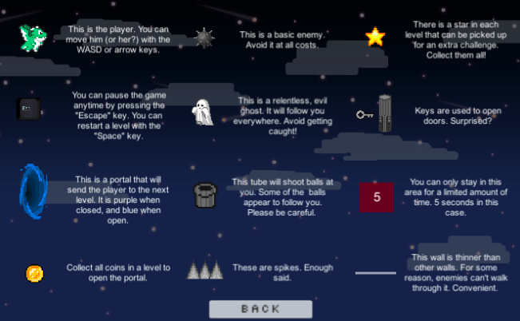

# Unity-2D-Game-Project
This is a small 2D platformer game featuring 8 customized levels. You play as a dragon and the objective is to finish the levels without being hit by any moving objects or enemies.

The project was made with Unity 2018.2.8f1

## How it looks like
### Level 2

### Level 7

### How to play
